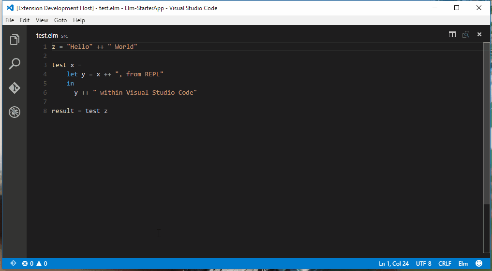

[](https://travis-ci.org/sbrink/vscode-elm)

# Elm support for Visual Studio Code

Elm needs a good IDE. So let's extend VS Code and make developing in [elm](http://elm-lang.org) even more enjoyable. Currently 3 people are actively maintaining/developing this plugin.


## Feature overview

* [x] Syntax highlighting
* [x] [Snippets](snippets/elm.json)
* [x] **Experimental** support for error highlighting
* [x] Function information
* [x] REPL - Run any line in an interactive shell
* [x] Reactor support (Webserver/Debugger) - Starting/Stopping
* [x] TODO: Autocompletion
* [ ] TODO: Add more useful code snippets
* [ ] TODO: Refactoring support


## Feature details

### Syntax highlighting

Syntax highlighting is essential. The full language is supported. Can we improve the highlighting further? Please create an [issue](https://github.com/sbrink/vscode-elm/issues)!


### Error highlighting


We support error highlighting **on save**. If you check *Auto save* under File, you should get feedback immediately.

This is marked **experimental** because we still have to improve the project detection.
We'll solve this in the next days.

### Function information


You can hover over a function and get the signature and comment.

### REPL



Not sure about the output of a function? Test it from inside the editor.

Open the actions menu and use one of the following commands:

* Elm: REPL - Start
* Elm: REPL - Send Line
* Elm: REPL - Send Selection
* Elm: REPL - Send File


### Reactor support


Reactor is the webserver which comes with Elm.

* Reactor allows recompiling on-the-fly.
* Reactor contains the [Time-traveling debugger](http://debug.elm-lang.org/).

We support starting / stopping from within the editor.

### Snippets

We support snippets for the basic language features. To use them, press `Ctrl+Space` and start typing.
Or start with some characters and use `Ctrl+Space` for autocompletion.

Want to know more? Look at the [snippet definitions](snippets/elm.json)

### Format

[elm-format](https://github.com/avh4/elm-format) is supported via the editor's `Format Code` command. To format your code using `elm-format`, press `Shift+Alt+F` on Windows, `Shift+Option+F` on Mac, or `Ctrl+Shift+I` on Linux.

You can also configure `elm-format` to run on save by enabling the `elm-format.formatOnSave` in your settings.

```
// settings.json
{
    "elm-format.formatOnSave": true
}
```


## Help wanted

Building all these things will take some time. So pull requests are much appreciated!


## Acknowledgements

* Grammar file is taken and converted from [atom-elm](https://github.com/edubkendo/atom-elm).
* Initial snippets from [Elm.tmLanguage](https://github.com/deadfoxygrandpa/Elm.tmLanguage)

## License

[MIT](LICENSE.txt)
